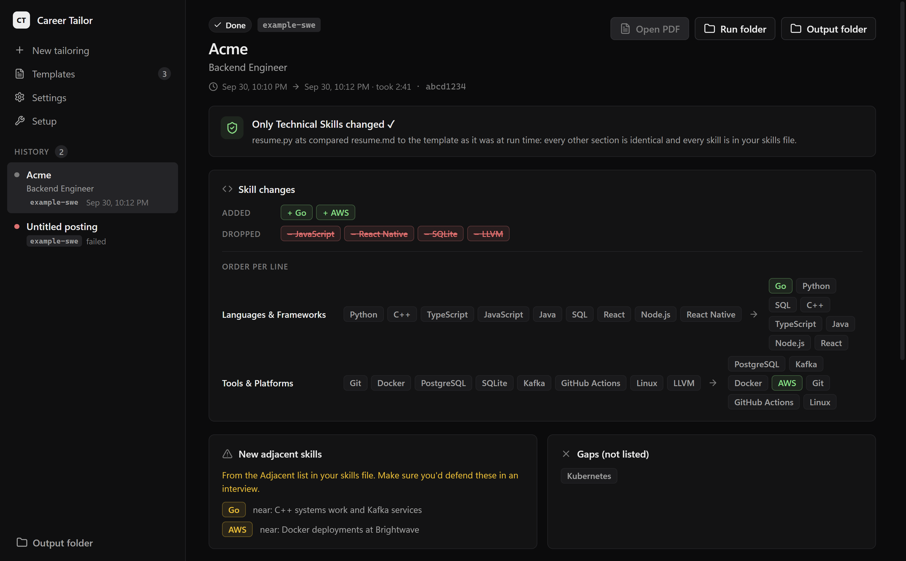

# Career Tailor

Paste a job description, pick your resume template, and a coding agent rewrites only the Technical Skills section
to match the posting for ATS filters. You get a one-page PDF and a diff you can audit.



Only Technical Skills changes. Your bullets, dates, and contact info are never touched, and every run is checked
against your template to prove it.

## How it works

```
job description + your template.md + skills.md
        |
        v
  validate template  -->  coding agent (Claude Code)
                          reorders / adds skills from your allowlist
        |
        v
  ATS check: nothing but Technical Skills changed, no unlisted skills
        |
        v
  render with LaTeX (Tectonic)  -->  one-page Letter PDF
        |
        v
  output folder: PDF  +  run history with a diff against your template
```

## Download

Windows: download the installer from [GitHub Releases](https://github.com/danmano411/career-tailor/releases)
(`Career-Tailor-Setup-<version>.exe`).

macOS and Linux: no prebuilt binary yet, [build from source](#build-from-source).

## Requirements

- [Claude Code CLI](https://docs.anthropic.com/en/docs/claude-code), installed and logged in (`claude --version` works)
- Python 3.10+ on your PATH
- Tectonic (LaTeX engine): downloaded automatically on first run from the setup screen, or use one already on PATH

## Setup

1. Install Claude Code and log in, and install Python 3.10+.
2. Run the Career Tailor installer and open the app.
3. The setup checklist shows what is missing. Click Install next to Tectonic if it is not found.
4. Open Settings and choose your templates, output, and runs folders (defaults are under
   `Documents/Career Tailor/`; the example template and its `skills.md` are copied in on first run).
5. Add your own template to the templates folder: either write it by hand using the
   [template format](docs/TEMPLATE_FORMAT.md), or give your PDF/DOCX resume to a coding agent with the
   copy-paste prompt in that doc ("Convert your existing resume"). Click Re-scan.

## Usage

1. Pick a valid template (the status shows a check, warnings, or errors).
2. Paste the job description and press Ctrl+Enter, or click Tailor resume. Up to 3 runs go at once.
3. When a run finishes, open it for the diff: integrity badge, added/dropped/reordered skills, adjacent and gap
   skills, the line diff against your template, job keywords, and the agent's notes.
4. The PDF is saved in your output folder named with your file name format.

Skills the agent may use come from your skills file (`## Skills` and `## Adjacent`, see
[template format](docs/TEMPLATE_FORMAT.md)). If you do not set one, `skills.md` in your templates folder is used,
and created from your template if that file does not exist.

## Settings

| Setting | Default | Notes |
|---------|---------|-------|
| Templates folder | `Documents/Career Tailor/templates` | `*.md` templates, watched for changes |
| Output folder | `Documents/Career Tailor/output` | Finished PDFs |
| Runs folder | `Documents/Career Tailor/runs` | One folder per run with `run.json` |
| Skills file | `<templates folder>/skills.md` | Optional allowlist; created from the template if the file does not exist |
| Python path | `python` (Windows), `python3` (macOS/Linux) | Interpreter used to run the backend |
| Agent | `claude` | Claude Code CLI |
| Model | `sonnet` | Passed to the agent |
| File name format | `{name} Resume - {company} {role}` | Output PDF name |

## Privacy

Everything runs on your machine. Your templates, job descriptions, runs, and PDFs stay in the folders you chose.
The job description and your template are sent to your coding agent provider (Anthropic, via your Claude Code
login) and nowhere else. Other network use: the one-time Tectonic download, the LaTeX packages Tectonic fetches on
first render, and the posting page itself if you paste only a URL.

## Build from source

```
cd app
npm install
npm run build
npm run package     # Windows installer in app/dist
```

Backend tests:

```
python backend/resume.py --test
python backend/render.py --test
python backend/tailor.py --test
```

Command line, without the app:

```
python backend/resume.py validate examples/templates/example-swe.md
python backend/tailor.py --template <template.md> --jd-file <jd.txt> --work-dir <dir> --out-dir <dir>
```

## Roadmap

- Codex CLI backend
- Direct LLM API backend (no coding agent needed)
- macOS build
- More LaTeX layouts

## Troubleshooting

- **PDF will not re-render**: the old PDF is open in a viewer that locks the file. Close it and run again.
- **Template shows errors**: run `python backend/resume.py validate <file>` or read the reasons on the card. Common
  causes: no `## Technical Skills` section, skill lines not shaped like `**Label** – a, b`, or a bullet before any
  `###` entry. See [template format](docs/TEMPLATE_FORMAT.md).
- **`claude` not found**: install Claude Code, log in, and make sure `claude --version` works in a new terminal, then
  restart the app so it picks up PATH.
- **Template is over one page**: shorten bullets or drop an entry; the app will not trim it for you.

## License

[MIT](LICENSE)
